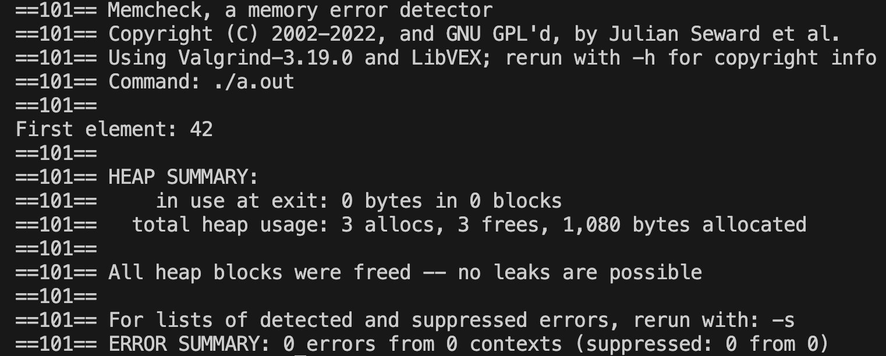

# Mini Garbage Collector

A lightweight, **highly portable** garbage collection system in C that efficiently manages dynamically allocated memory, preventing memory leaks using a singly linked list.

## Why This Garbage Collector?

- **Effortless Integration**: Just initialize **once**, and replace `malloc` with `ft_malloc` wherever garbage collection is needed.
- **No Need to Pass References**: Unlike traditional memory managers, **you don't have to pass the garbage collector around**. A static variable holds the reference upon initialization, making it accessible globally.
- **Automatic Memory Tracking**: Memory blocks are registered upon allocation, ensuring nothing is lost.
- **Lightweight & Efficient**: No complex dependencies—just a straightforward and effective memory management tool.
- **Seamless Expansion**: Memory blocks are dynamically added to the collector’s linked list through `ft_malloc()`, which calls `gc_add_begin(ptr)` under the hood.
- **Unobtrusive**: If garbage collection isn't needed, simply use `malloc()` as usual. The garbage collector **only** affects the parts of the code where you opt in by using `ft_malloc()`.

---

## How It Works

### 1. Initializing the Garbage Collector

Initialize **once** at the start of your program, and you're set for the rest of its execution:

```c
#include "garbage_collector.h"

t_garbage_collector *gc_init_garbage_collector(void);
```

### 2. Allocating Memory with Zero Hassle

Forget about passing memory references between functions! With `ft_malloc()`, memory is automatically tracked:

```c
void *ft_malloc(size_t len);
```

Example:

```c
int *arr = (int *)ft_malloc(sizeof(int) * 10); // Allocates memory for 10 integers
```

### 3. Freeing All Allocated Memory Instantly

When the program no longer needs allocated memory, **free everything in one command**:

```c
void gc_free_all(void);
```

Example:

```c
gc_free_all(); // Releases all allocated memory at once
```

### 4. The Ultimate Cleanup Before Exiting

To ensure no memory leaks remain, call `main_cleanup()` before program termination:

```c
noreturn void main_cleanup(void);
```

Example:

```c
main_cleanup(); // Cleans up everything before exiting
```

---

## Example Program

Here's how easily the garbage collector integrates into a C program:

```c
#include "garbage_collector.h"
#include <stdio.h>

int main(void)
{
    gc_init_garbage_collector();

    int *arr = (int *)ft_malloc(sizeof(int) * 5);
    if (!arr)
        return 1;

    arr[0] = 42;
    printf("First element: %d\n", arr[0]);

    main_cleanup();
    return 0;
}
```

---

## Core Functions

### `gc_free_all()`

Frees **all** memory allocated through `ft_malloc()` and resets the garbage collector.

```c
void gc_free_all(void);
```

### `main_cleanup()`

Ensures a **graceful** program termination by clearing memory and resetting the garbage collector:

```c
void main_cleanup(uint8_t exit_stat)
{
    gc_free_all();
    ft_bzero(get_gc(), sizeof(t_garbage_collector));
    exit(exit_stat);
}
```

---

## Debugging & Memory Leak Detection

Run Valgrind to verify perfect memory management:

```bash
valgrind --leak-check=full --show-leak-kinds=all --track-origins=yes ./a.out
```

---

## Compilation Instructions

Compile the project with:

```bash
cc -Wall -Werror -Wextra -g main.c at_exit.c gb_garbage_collector.c gb_utils.c
```

Ensure the necessary headers (`garbage_collector.h`, `libft.h`) are included.

---

## Why Choose This Over Manual Memory Management?

Managing memory manually in C is **error-prone**. Forgetting even a \*\*single \*\***`free()`** call can result in memory leaks, leading to bloated programs and undefined behavior.

With this garbage collector:

- **Initialize once, and forget about tracking pointers manually.**
- **No tedious passing of memory management references.**
- **Seamless drop-in replacement for ********`malloc()`********.**
- **Eliminate memory leaks with a single cleanup function.**

---

## Future Improvements

- Enhance error handling mechanisms.
- Optimize memory allocation efficiency.
- **Category-Based Memory Management** *(Planned Feature)*:
  - A future version may introduce a **free\_group()** function to selectively free specific memory allocations based on categories.
  - `ft_malloc()` will take an additional string parameter to categorize allocated memory.
  - `free_group(char *category)` will loop through the linked list and compare node categories using `strncmp()`, freeing only matching nodes.
  - If `ft_malloc()` is used without a category, it will default to `NULL`.
  - This feature allows precise control over memory cleanup without affecting unrelated allocations.

---

## License

This project is open-source and available for modification and distribution under the specified license.

