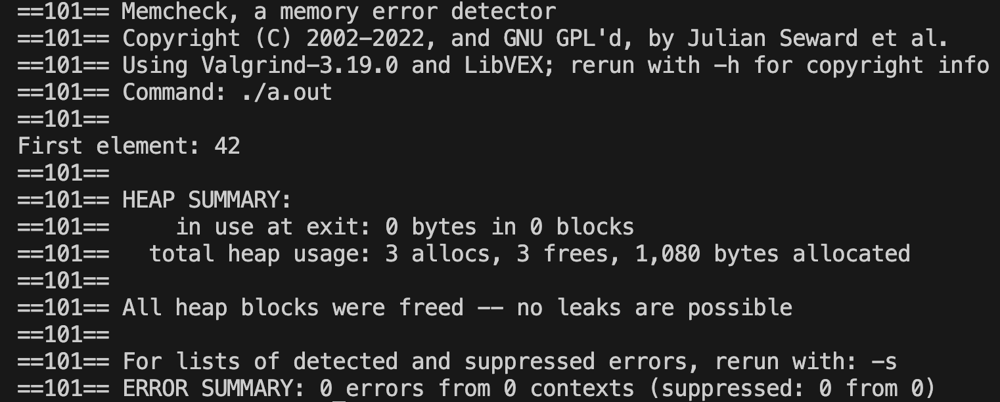

# Garbage Collector - README

## Overview
This project provides a simple garbage collection system in C using a linked list to manage dynamically allocated memory. The system ensures that all allocated memory is tracked and freed, preventing memory leaks. Additionally, a cleanup function (`main_cleanup`) is provided to free all memory and reset the garbage collector when the program terminates.

## Features
- **Linked List-Based Garbage Collection:**
  Memory blocks are tracked in a linked list, enabling efficient memory management.

- **Automatic Memory Management:**
  Custom memory allocation function (`ft_malloc`) automatically registers memory blocks with the garbage collector.

- **Batch Memory Deallocation:**
  All memory blocks tracked by the garbage collector are freed at once using `gc_free_all()`.

- **Program Cleanup:**
  The `main_cleanup()` function frees all allocated memory, resets the garbage collector, and exits the program.

## Files
- **gb_garbage_collector.c**: Implements the core garbage collection system, including adding memory blocks to the collection list, creating nodes, and freeing all memory.
- **gb_utils.c**: Provides utility functions for memory allocation and linked list operations.
- **main_cleanup**: A cleanup function that frees all memory, resets the garbage collector, and terminates the program.

## Usage

### Garbage Collector Operations

1. **Initialize Garbage Collector**
   Sets up an empty garbage collector to track dynamically allocated memory.

   ```c
   t_garbage_collector *gc_init_garbage_collector(void);
   ```

2. **Allocate Memory with Garbage Collector**
   Allocates memory and registers the allocated block with the garbage collector, so it can be freed later.

   ```c
   void *ft_malloc(size_t len);
   ```

   Example:
   ```c
   int *arr = (int *)ft_malloc(sizeof(int) * 10); // Allocates memory for 10 integers
   ```

3. **Free All Allocated Memory**
   Frees all memory blocks tracked by the garbage collector and clears the linked list.

   ```c
   void gc_free_all(void);
   ```

   Example:
   ```c
   gc_free_all();  // Frees all allocated memory
   ```

4. **Program Cleanup and Exit**
   The `main_cleanup()` function handles freeing all memory, clearing the garbage collector, and exiting the program.

   ```c
   noreturn void main_cleanup(void);
   ```

   Example:
   ```c
   main_cleanup();  // Cleans up and exits the program
   ```

### Example Program

```c
#include "garbage_collector.h"
#include <stdio.h>

int main(void)
{
   // Initialize the garbage collector
   gc_init_garbage_collector();

   // Allocate memory using ft_malloc
   int *arr = (int *)ft_malloc(sizeof(int) * 5);
   if (!arr)
       return 1;

// Use the allocated memory
   arr[0] = 42;
   printf("First element: %d\n", arr[0]);
   // Clean up and exit
   main_cleanup(0);
   return 0;
}
```

### Cleanup Function
The `main_cleanup()` function does the following:

- Calls `gc_free_all()` to free all allocated memory.
- Clears the garbage collector's internal state with `ft_bzero()`.
- Terminates the program with `exit()`.

```c
void main_cleanup(uint8_t exit_stat)
{
    gc_free_all();
    ft_bzero(get_gc(), sizeof(t_garbage_collector));
    exit(exit_stat);  // Exits the program with the appropriate exit status
}
```

## Leak-Check using Valgrind
## command: valgrind --leak-check=full --show-leak-kinds=all --track-origins=yes ./a.out


## Compilation
To compile your program, include the necessary headers (`garbage_collector.h`, `main.h`, `libft.h`) and link the required libraries:

```bash
cc -Wall -Werror -Wextra -g main.c at_exit.c gb_garbage_collector.c gb_utils.c
```

## Future Work
- Extend error handling for memory operations.

## License
This project is open-source. You are free to use, modify, and distribute it under the relevant open-source license.
